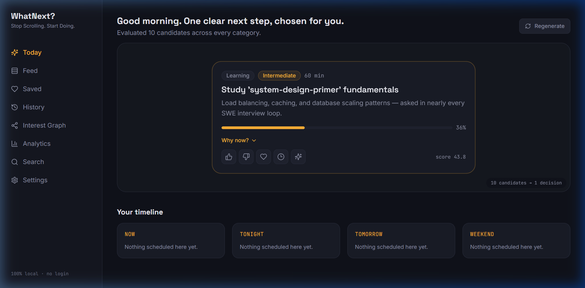
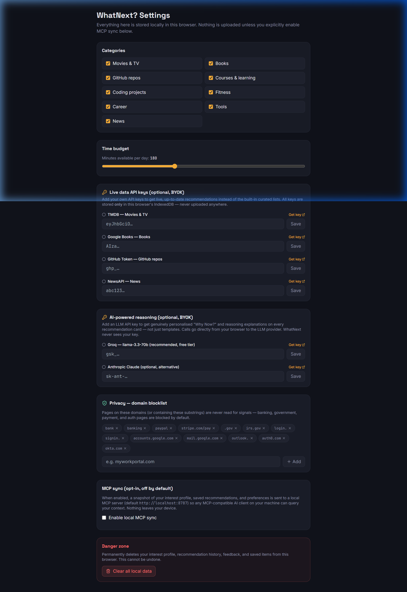

# WhatNext? — Stop Scrolling. Start Doing.



> **WhatNext?** is an AI-powered, privacy-first, category-independent Chrome extension that tells you the **single most valuable thing to do next** — movies, books, GitHub repos, courses, coding projects, fitness, career, tools, and news — ranked against one shared local interest model.

---

## 🛡️ Privacy Guarantees & Domain Blocklist

WhatNext? is built on a zero-tracking, privacy-first architecture. **No data ever leaves your browser.**

- **100% Local Storage**: Interest profile, recommendation history, and user feedback live entirely in IndexedDB inside your browser.
- **Automatic Sensitive Page Protection**: Pages containing password input fields or login/payment URL paths (`/login`, `/signin`, `/checkout`, `/payment`, `/account/security`) are automatically ignored — zero signals are read.
- **Default Domain Blocklist**: Includes pre-configured patterns for banking, government, auth, and webmail providers:
  `bank`, `banking`, `paypal`, `stripe.com/pay`, `.gov`, `irs.gov`, `login.`, `signin.`, `accounts.google.com`, `mail.google.com`, `outlook.`, `auth0.com`, `okta.com`
- **Custom Blocklist**: Easily add workplace portals, personal domains, or sensitive URLs in Settings.
- **Privacy Policy**: Read our complete [Privacy Policy](website/privacy.html).

---

## 🔌 Model Context Protocol (MCP) Server Built-in

WhatNext? ships with a native **Model Context Protocol (MCP)** server (`mcp-server/`) built on `@modelcontextprotocol/sdk`. 

When local MCP sync is enabled, any MCP-compatible AI client — such as **Claude Desktop**, **Cursor**, or local LLMs — can query your real-time local interest profile and ask *"What should I do next?"* directly inside your AI chat!



### MCP Resources & Tools
- **Resources**: `whatnext://interest-profile`, `whatnext://recommendation-history`, `whatnext://saved-recommendations`, `whatnext://preferences`, `whatnext://current-context`
- **Tools**: `generate_recommendations`, `explain_recommendation`, `update_interests`, `record_feedback`, `search_interests`
- **Prompts**: `what-should-i-do-next`, `recommend-a-coding-project`, `recommend-a-movie`
- **Security**: 100% local (`localhost:8787` loopback & `stdio`), opt-in sync, zero cloud transmission.

---

## 📸 Interface Showcase

### Dashboard & Daily Recommendation


---

## ✨ Key Features

- **🎯 Unified 12-Category Engine**: Evaluates Movies, Books, GitHub Repos, Courses, Projects, Fitness, Career, Tools, News, Travel, Stock Market, and Shopping Deals in parallel.
- **⚡ Live Data Providers (BYOK)**: Fetch real-time up-to-date recommendations using optional API keys:
  - **TMDB**: Live popular movies and TV shows matching your interest tags.
  - **Google Books**: Targeted book discovery based on your top reading topics.
  - **GitHub API**: Trending repositories matching your development interests.
  - **NewsAPI**: Personalised headlines and tech digests.
- **🤖 Groq LLM Reasoning**: Integrates Groq (`llama-3.3-70b-versatile`) via BYOK to generate personalised, natural-language *"Why Now?"* and *"AI Reasoning"* explanations for top recommendations.
- **🔌 Native MCP Integration**: Connect your interest profile directly to Claude Desktop, Cursor, or AI clients via Model Context Protocol.
- **🛡️ Built-in Privacy & Domain Blocklist**: Pre-loaded blocklist protecting financial, login, government, and payment pages.

---

## 📦 Quick Installation (No Build Tools Required)

1. Download the latest `whatnext-extension.zip` from our website or repository.
2. Unzip the file into a folder on your computer.
3. Open Chrome and navigate to `chrome://extensions`.
4. Enable **Developer mode** in the top-right corner.
5. Click **Load unpacked** and select the unzipped folder.

---

## 🏗️ Monorepo Architecture

WhatNext? is structured as an `npm` workspace monorepo:

| Package / Folder | Purpose |
|---|---|
| [`core`](core) | Storage-agnostic core engine: interest profile modeling, providers, multi-factor ranking, timeline generator, and Groq LLM enrichment. Pure TypeScript. |
| [`extension`](extension) | Chrome Extension (MV3): background worker, content script for signal capture, popup UI, settings panel, and dashboard. |
| [`mcp-server`](mcp-server) | Standalone local Model Context Protocol (MCP) server for local AI client interoperability. |
| [`website`](website) | Next.js landing page with direct extension zip download and setup instructions. |

---

## 🛠️ Development & Building from Source

```bash
# Clone the repository
git clone https://github.com/abhilash15498/What-next.git
cd What-next

# Install dependencies
npm install

# Build core and extension
npm run build

# Start extension dev server
npm run dev

# Start landing page website dev server
npm run dev:web
```

---

## 📜 License & Privacy

- [Privacy Policy](website/privacy.html)
- Open source under the [MIT License](LICENSE).
